# blockly-ai-playground #

experiment with AI and build your own AI agents using Blockly - even if you are a complete beginner! (also suitable for school lessons)

> (Work in progress - intended as a contribution to the [Backdrop Build](https://backdropbuild.com/) contest, please stay tuned - contest ends at August, 2nd)

[Live Demo](https://rozek.github.io/blockly-ai-playground/LiveDemo) **Warning: please read "Overview" and "Prerequisites" first**

> **CORS note: modern browser security measures may complicate API requests. To succeed, you may have to install a "CORS Unblocking" extension into your browser (like [this](https://webextension.org/listing/access-control.html) one)**

> **Recommendation: start with the [basic Settings example](#basic-settings) and enter your `APIServer`, `APIKey` and `default_model` settings, at least. Then use the [PoC example](#proof-of-concept) and run your first inferences. If you have API access to a SearXNG server, you may also try the [AI-assisted Web Search](#ai-web-search-with-live-reporting) to learn about the benefits of an AI agent**

> **Please note: the "blockly-ai-playground" has only been tested with Perplexity AI on a Mac so far**

> You have comments, wishes or ideas? You found a bug? Then [open an issue](https://github.com/rozek/blockly-ai-playground/issues). You like this tool and plan to use it? Then leave a star!

## Overview ##

AI agents are "cool" these days and can be found at many places - but for most of us, they are basically just "black boxes" which do not reveal how they work internally.

[Blockly](https://developers.google.com/blockly) is a visual programming environment developed by Google that allows users to create code using drag-and-drop "Lego"-like blocks. It is designed to simplify coding by abstracting away the syntax, making it accessible for beginners and educational purposes.

By combining these two technologies, the "blockly-ai-playground" offers beginners and casual programmers an easy way to play and experiment with AI and build their own AI agents!

## Prerequisites ##

The "blockly-ai-playground" can be used with any AI provider offering an [OpenAI compatible API](https://platform.openai.com/docs/api-reference) - this may be [OpenAI](https://openai.com/) itself, [Perplexity](https://www.perplexity.ai/) (which was used for development), [Ollama](https://ollama.com/) (which runs LLMs locally on one's computer) and, presumably, many others.

As a consequence, you will need

* the **URL of an API entry point** (either locally on your machine or on the internet) and
* an **API Access Key** if you are using an official AI provider

While you may already use large language models (LLMs) on their own, they can only show their true capabilities in combination with other tools - this is what makes "agents" so powerful.

One of these tools is the web search. Since automating search engines is quite tedious, the "blockly-ai-playground" uses [SearXNG](https://docs.searxng.org/) for that purpose. Although there are several [public servers](https://searx.space/) which offer a web interface similar to other search engines, the [SearXNG API](https://docs.searxng.org/dev/search_api.html) is normally not publically available and you should run your own SearXNG instance instead (which does not have to be public but may remain private) - fortunately, installation is really simple if you use [Docker](https://www.docker.com/) (which is free for personal use, choose "Docker Desktop" rather than the CLI version - it is much simpler to maintain)

Thus, if you want to use the built-in web search, you should install

* [Docker Desktop](https://www.docker.com/products/docker-desktop/)
* [SearXNG](https://docs.searxng.org/admin/installation-docker.html)

## Custom Blocks ###

Besides common blocks which can be found in many Blockly environments, the "blockly-ai-playground" also provides a set of custom blocks to manage an internal context, a simple (but dynamic) user interface, basic and enhanced functions for AI, auxiliary tools for AI agents and other useful functions.

### Playground Context ###

The playground manages a dynamic "context" which is a collection of "items", consisting of a "value" (typically a boolean, number or string) and its unique "name". Context items can store settings (e.g., the URL of an API server, its access key or the AI model to use) or intermediate results generated by an agent or they provide a link between an agent and its user interface.

> Please note, that context item names are case-sensitive.

Some context items are already used internally, these are

* `APIServer` - the URL (and base path) of the OpenAI-compatible API you plan to use
* `APIKey` - your API Access Key (if required)
* `SearXNGServer` - the URL of your SearXNG server (preset to `http://127.0.0.1:8080`)

the inferencing parameters

* `default_model` - the model to use for completions (no preset, as it highly depends on the configured API Server)
* `default_max_tokens` - the maximum number of completion tokens to be returned (preset to 2048)
* `default_temperature` - the "response randomness" setting (0...2, preset to 0)
* `default_top_p` - the "nucleus sampling threshold" setting (0...1, no preset)
* `default_top_k` - the "top-k filtering setting" setting (0...2048, preset to 1)
* `default_presence_penalty` - the "token presence penalty" setting (-2...2, preset to 1)
* `default_frequency_penalty` - the "token frequency penalty" setting (0..., no preset)
* `default_SystemTemplate` - the default template for the "system" message in a chat (preset to `Be precise and concise.`)
* `default_UserTemplate` - the default template for the "user" message in a chat (preset to `{{Prompt}}`)

and

* `Console` - the current contents of the built-in "Console" (initially empty)

In addition to the items listed above, "AI Mezzanine" blocks provide their own context items in order to allow customization of their internal API calls. To find these items, simply replace the `default` prefix of the inferencing parameter items by the prefix for the given mezzanine (e.g., 'summary_max_tokens' specifies the token generation limit for text summarization). If any mezzanine-specific context item is removed (or empty) the related default setting is used instead.

#### Preserve and Restore ####

During development it is sometimes useful to keep settings and values beyond the life-time of a single program. Typical use case are:

* you use one Blockly program to define APIServer, APIKey or other settings and use these settings in other Blockly programs
* you save intermediate results in order to avoid having to rerun the steps to compute these results over and over again

These two blocks provide such a functionality: use the first block to preserve a given context item and the second to restore it later

#### Context-related Blocks ####

> returns a list with the names of all currently defined context items (see [related example](#context))

> clears the context (i.e., deletes all currently defined context items) (see [related example](#context))

> returns the current value of a given context item. If the requested item does not exist, `undefined` is returned (see [related example](#context))

> sets the given context item to the given value. If the addressed item does not exist, it will be created (see [related example](#context))

> removes the given context item. It is safe to remove an item which does not exist (see [related example](#context))

> preserves the given context item (as a string) in the Browser Storage. If the addressed item does not exist, an empty string will be preserved (see [related example](#preserve-restore))

> restores the given context item (as a string) from the Browser Storage. If the addressed item was not preserved before, the context item will be set to an empty string (see [related example](#preserve-and-restore))

### Playground UI ###

The playground also manages a programmable reactive "user interface" (aka "UI"). The playground UI is basically a vertical list of user interface "elements", often preceeded by a "label".

Every UI element has a unique "name" which is bound to a context item with the same name. As a consequence,

* changing the value of a context item automatically updates the contents of a bound UI element and
* entering data into a UI element automatically updates the assciated context item

This concept makes UI programming super easy.

#### Event Loop ####

Often, a program has to react on user inputs. In the simplest way, this just means to present a few input fields to the user (e.g., to enter `APIServer`, `APIKey` and a `Prompt`) and to start inferencing as soon as the user has pressed a button. In the meantime, the UI may also be used to inform the user about the validity of any inputs while (s)he is entering them.

This is achieved by an "event loop".

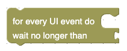

The core of any event loop is one of the blocks shown above. Each of them waits for incoming UI "events" (which indicate that the user has entered some data or clicked on a button) and then executes a sequence of inner blocks (the so called "loop body").

Within the loop body you may now check what the user actually did and react accordingly - this is what the two blocks shown above are good for:

* the first one returns `true` if a button with the given name was pressed and
* the second one returns `true` if the user entered new data into an input element with the given name

Both blocks are typically placed into the condition field of an "if-then" block to run the "then" clause only if the given button was pressed or the given input element received new data.

The loop body is executed over and over again - until the loop is exited using the block shown above.

A Blockly program may contain several event loops - but only one of them may be running at the same tine.

#### Enabling ####

Often, a programmer wants to prevent buttons to be clicked or new data entered into input fields. Typical situations are

* users should not be able to start inferencing by pressing a "Submit" button before `APIServer`, `APIKey` and `Prompt` were entered (and valid)
* users should not be able to interact with the UI while an API request is running

This behaviour is achieved by "enabling" or "disabling" either the UI as a whole or specific UI elements only.

The two blocks shown above enable or disable the playground UI in its entirety. Disabling the whole UI disables all UI elements, while "enabling" the whole UI means that the enabling of every UI element depends on its own setting (i.e., elements may still be individually disabled)

These two blocks enable or disable specific UI elements.

#### UI-related Blocks ####

> switches to the playground workspace pane

> switches to the playground user interface pane

> (re-)enables the playground UI in its entirety. Please note that "enabling the whole UI" only means that the UI is no longer disabled in its entirety and every UI element is now enabled or disabled depending on its own setting (see [related example](#enable-and-disable))

> disables the playground UI in its entirety (see [related example](#enable-and-disable))

> returns a list with the names of all currently defined UI elements

> returns `true` if the UI currently contains an element with the given name - or `false` otherwise

> clears the user interface (i.e., deletes all currently defined UI elements)

> removes the element with the given name from the UI. It is safe to remove an element which does not exist

> appends a textline input element (based on an [HTML input element of type "text"](https://developer.mozilla.org/en-US/docs/Web/HTML/Element/input/text)) with the given name and label to the UI. If an element with the same name already exists, it is removed before the new one is appended. This element supports the options `Placeholder`, `readonly`, `minLength`, `maxLength`, `Pattern`, `SpellChecking` and `Enabling` (see [related example](#textline-input))

> appends a password input element (based on an [HTML input element of type "password"](https://developer.mozilla.org/en-US/docs/Web/HTML/Element/input/password)) with the given name and label to the UI. If an element with the same name already exists, it is removed before the new one is appended. This element supports the options `Placeholder`, `readonly`, `minLength`, `maxLength`, `Pattern` and `Enabling`

> appends a number input element (based on an [HTML input element of type "number"](https://developer.mozilla.org/en-US/docs/Web/HTML/Element/input/number)) with the given name and label to the UI. If an element with the same name already exists, it is removed before the new one is appended. This element supports the options `Placeholder`, `readonly`, `Minimum`, `Maximum`, `Stepping` and `Enabling`

> appends a URL input element (based on an [HTML input element of type "url"](https://developer.mozilla.org/en-US/docs/Web/HTML/Element/input/url)) with the given name and label to the UI. If an element with the same name already exists, it is removed before the new one is appended. This element supports the options `Placeholder`, `readonly`, `minLength`, `maxLength`, `Pattern` and `Enabling`

> appends a (multiline) text input element (based on an [HTML textarea](https://developer.mozilla.org/en-US/docs/Web/HTML/Element/textarea)) with the given name and label to the UI. If an element with the same name already exists, it is removed before the new one is appended. This element supports the options `Placeholder`, `readonly`, `minLength`, `maxLength`, `LineWrapping`, `SpellChecking` and `Enabling`

> appends an input element (with the given name and label) to the UI that can be used to listen to and recognize what a user says into a microphone. If an element with the same name already exists, it is removed before the new one is appended. This element supports the options `Placeholder`, `readonly`, `minLength`, `maxLength`, `LineWrapping`, `SpellChecking` and `Enabling` (see [related example](#speechinput))

> Nota bene: speech recognition requires microphone access - for that reason the browser may ask for permission to use your PC's microphone. Recognition will only work if you grant that permission - or else fail.

> **Important: not all browsers support speech recognition (Chrome seems to, but other browsers may not - even if they are based on webkit). Additionally, the playground must be served over valid (and secure!) HTTPS**

> appends a checkbox element (based on an [HTML input element of type "checkbox"](https://developer.mozilla.org/en-US/docs/Web/HTML/Element/input/checkbox)) with the given name and label to the UI. If an element with the same name already exists, it is removed before the new one is appended. This element only supports the option `Enabling`

> appends a radio button group element (based on an [HTML input elements of type "radio"](https://developer.mozilla.org/en-US/docs/Web/HTML/Element/input/radio)) with the given name and label to the UI. If an element with the same name already exists, it is removed before the new one is appended.
>
> Radiobutton groups are a bit special as they contain a whole group of radio buttons, each with its own label. As a consequence, after appending a new radio button group element, you will have to define a list of radio buttons using the "append Choice" block - and the value of the whole group (i.e., the associated context item) is the (0-based) index of the currently checked radio button (or `-1` if no button is checked) (see [related example](#radiobutton-group))

> appends a drop-down element with the given name and label to the UI. If an element with the same name already exists, it is removed before the new one is appended
>
> After adding a new DropDown to the UI, you still have to define the entries from which the user may select. This can be done using the "append Choice" block - one per selectable entry. The context item associated with the DropDown will then contain the (0-based) index of the currently selected entry

> appends a button element with the given name and label to the UI. If an element with the same name already exists, it is removed before the new one is appended

> appends a textline output element with the given name and label to the UI. If an element with the same name already exists, it is removed before the new one is appended (see [related example](#output-elements))

> appends a number output element with the given name and label to the UI. If an element with the same name already exists, it is removed before the new one is appended (see [related example](#output-elements))

> appends a (multiline) text output element with the given name and label to the UI. If an element with the same name already exists, it is removed before the new one is appended (see [related example](#output-elements))

> appends an unlabelled text view element with the given name to the UI. If an element with the same name already exists, it is removed before the new one is appended (see [related example](#output-elements))

> appends an unlabelled "fine print" view element with the given name to the UI. If an element with the same name already exists, it is removed before the new one is appended (see [related example](#output-elements))

> appends a URL input element customized for the selection or input of the `APIServer` context item with the given label to the UI. If an element with the name `APIServer` already exists, it is removed before the new one is appended. This element supports the options `Placeholder`, `readonly`, `minLength`, `maxLength`, `Pattern` and `Enabling`

> sets the current value of a given option for an UI element with the given key to a given value. If no element with the given key can be found, an exception is thrown and the program aborted. Which options and option values are meaningful (and, thus, used by the UI), depends on the type of the given UI element

> returns the current value of a given option for an UI element with the given key. If no element with the given key can be found, an exception is thrown and the program aborted. The requested option does not have to exist

> returns `true` if an UI element with the given key is enabled or `false` otherwise. If no element with the given key can be found, an exception is thrown and the program aborted.

> enables the UI element with the given key. If no element with the given key can be found, an exception is thrown and the program aborted (see [related example](#enable-and-disable))

> disables the UI element with the given key. If no element with the given key can be found, an exception is thrown and the program aborted (see [related example](#enable-and-disable))

> returns `true` if an UI element with the given key (exists and) is enabled. If no element with the given key can be found, an exception is thrown and the program aborted.

> clears all currently defined choices of a radiobutton group or a drop-down element

> appends the given text to the list of choices for a radiobutton group or a drop-down element

> clears the built-in "Console" (see [related example](#console))

> appends the given string to the built-in "Console" (see [related example](#console))

> appends the given string to the built-in "Console" and starts a new line (see [related example](#console))

> removes all pending UI events from the internal queue. If there are no pending events, this statement is simply ignored

> starts an event loop and runs the given statements whenever a new UI event was received. If the given timeout is `0` the loop is exited as soon as no more UI events are pending. If the given timeout is greater than `0` the loop is exited if no event was received within the given number of seconds. With a negative timeout, the loop waits indefinitely for the next UI event

> starts an event loop and runs the given statements whenever a new UI event was received, waiting indefinitely for new events

> returns `true` if the currently processed UI event is a click on a button with the given name - or `false` otherwise (see [related example](#button-clicks))

> returns `true` if the currently processed UI event indicates that new input for the UI element with the given name was received - or `false` otherwise

> leaves the current event loop

### AI Basics ###

The following blocks perform basic AI functions

> performs a chat completion for the given list of messages and returns the string created by the LLM. The message list must consist of an initial "system" message, a "user" message and (optionally) a sequence of "assistant" and "user" messages. If provided, any required options (such as `model`, `temperature`, `top_k` etc.) are taken from context items whose names start with the given option prefix. If such context items do not exist, are empty or the prefix is missing, any options are taken from context items whose names start with `default_`

> performs a text completion for the given prompt. The prompt is used to generate a "system" and a "user" message which are then used to generate a "chat completion". The "system" message is generated from the `SystemTemplate` context item, the "user" message from `UserTemplate`. If provided, any required options (such as `model`, `temperature`, `top_k` etc.) are taken from context items whose names start with the given option prefix. If such context items do not exist, are empty or the prefix is missing, any options are taken from context items whose names start with `default_`.  

### AI Mezzanines ###

The following blocks internally use AI requests themselves to perform some tasks which are often found in AI agents:

> returns a summary of the given text. The block uses its own set of context items (prefixed with `Summary_`) to configure the inferencing parameters for text summarization - missing (or empty) items are taken from the default set

> generates a sequence of work steps to achieve a given goal. The result is a list of objects and should be processed accordingly (see [related example](#steps-derived-from-a-given-objective))

> generates a "phrase" which can be used to perform an internet search using a common search engine (or SearXNG) (see [AI Web Search](#ai-web-search) example)

> a web search usually returns a list of URLs - one per document that seems relevant. This block now fetches one of theses documents from the given URL, "reads" it and extracts any information that seems relevant for the given objective (see [AI Web Search](#ai-web-search) example)

> extracting information from a document may return nonsense. In order not to dilute the final result, this block checks if the given extract is actually relevant for the given objective or not. It returns `true` if it is or `false` otherwise (see [AI Web Search](#ai-web-search) example)

> extracting information from several documents yields a list of separate extracts which may overlap in their contents. This block takes two such extracts and combines them into a single response relevant for a given objective (see [AI Web Search](#ai-web-search) example)

> AI responses are often "noisy", i.e. they contain additional "decorative" words besides the actually requested information. This block therefore extracts the plain response and returns it as a list of facts (see example [AI Web Search with live Reporting](#ai-web-search-with-live-reporting))

### AI Support ###

The following blocks have been made to support the creation of AI agents.

> returns `true` if the given value is a string containing a Wikipedia URL - or `false` otherwise

> returns `true` if the given value is a string containing a Wikipedia page name - or `false` otherwise

> converts the given HTML into formatted text

> returns the first JSON object found in a given text - or `undefined` if no such JSON specification could be found (or the specification was incorrect)

> fetches the (english) Wikipedia article with the given page name and returns its contents as plain text

> searches the web for documents related to a given search phrase and returns a list with the URLs of the first found documents. The search request is sent to the SearXNG server specified in context item `SearXNGServer`, but found documents are only listed if they have a score greater than or equal to the threshold specified in context item `SearXNGScoreThreshold` (a number in the range 0...10 which defaults to 2)

> searches the (english) Wikipedia for articles related to a given search phrase and returns a list with the Wikipedia page names of the first found articles

### Miscellany ###

The following blocks do not fit into the categories shown before - may may still be helpful when creating agents:

> this block has no specific functionality but serves as a visual separator between adjacent blocks only - this may help identifying related blocks

> throws the given exception (which is then shown in an alert dialog) and aborts the running program (see related [example](#throw))

> waits for a given number of seconds and continues (see [Console example](#console))

> opens a browser "alert" pop-up dialog, displays the given message and continues as soon as the user has closed the dialog (see related [example](#alert-confirm-prompt))

> opens a browser "confirmation" pop-up dialog, displays the given message and continues as soon as the user has responded with "ok" or "Cancel". If cancelled, the block returns `false`, otherwise it returns `true` (see related [example](#alert-confirm-prompt))

> opens a browser "prompt" pop-up dialog, displays the given message and continues as soon as the user has entered a response. If cancelled, the block returns an empty string, otherwise it returns the entered string (see related [example](#alert-confirm-prompt))

> uses text-to-speech to speak the given (english!) message (see related [example](#text-to-speech))

> returns `true` if the given value contains a string that is neither empty nor contains whitespace only - or `false` otherwise

> returns `true` if the given value contains a number - or `false` otherwise

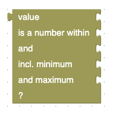

> returns `true` if the given value contains a number with a value ranging from the given minimum to the given maximum - or `false` otherwise. The additional arguments "withMinimum" and "withMaximum" specify wether the given "minimum" and "maximum" values are themselves part of that range or not

> returns `true` if the given value contains an integer number - or `false` otherwise

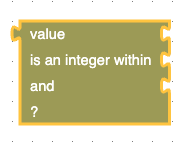

> returns `true` if the given value contains an integer number with a value ranging from the given minimum to the given maximum - or `false` otherwise

> returns `true` if the given value contains an "ordinal" number (i.e., an integer greater than or equal to 0) - or `false` otherwise

> returns `true` if the given value contains a "cardinal" number (i.e., an integer greater than or equal to 1) - or `false` otherwise

> returns `true` if the given value contains a string that matches a given JavaScript regular expression - or `false` otherwise

> returns `true` if the given value contains a string that looks like a URL - or `false` otherwise

> returns `true` if the given value contains a string that looks like a Wikipedia document URL - or `false` otherwise

### Object Support ###

The following blocks help to create and manipulate objects

> returns a newly created empty object (see related [example](#objects))

> returns a (possibly empty) list with the keys of all own properties of a given object (see related [example](#objects))

> returns `true` if the given object contains a proeprty with the given key - or `false` otherwise (see related [example](#objects))

> returns the current value of the given object's property with the given key (see related [example](#objects))

> sets the given object's property with the given key to a given value (see related [example](#objects))

> deletes the given object's property with the given key (see related [example](#objects))

## Examples ##

Here are a few examples which you can uploda into the Blockly workspace to get familiar with Blockly itself and the custom blocks specifically made for the "blockly-ai-playground". The linked Blockly workspace files should first be downloaded onto your computer and then uploaded into your Blockly workspace

### Hello, World ###

> this is the typical "Hello, World" example (see [Blockly workspace file](./Examples/Hello_World.json))

### Alert, Confirm, Prompt ###

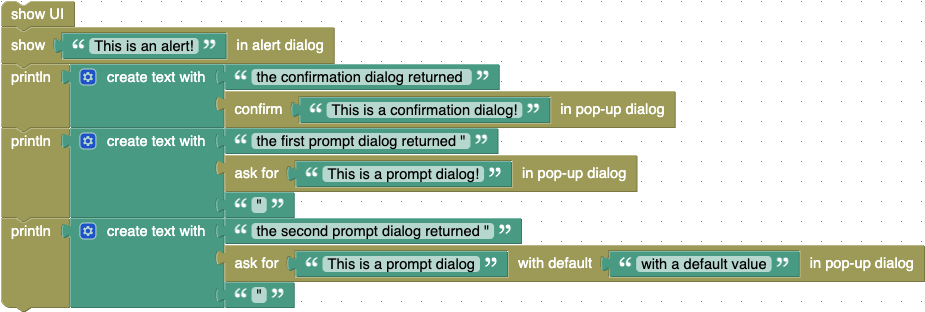

> if you do not want to implement a "real" user interface (with an event loop), it may already be sufficient to use the browser's built-in pop-up dialogs `alert`, `confirm` and `prompt` - for simple use cases, at least. This example demonstrates how to use them (see [Blockly workspace file](./Examples/Alert_Confirm_Prompt.json))

### Console ###

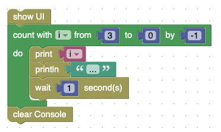

> this example demonstrates all Console functions (see [Blockly workspace file](./Examples/Console.json))

### Suspend, Resume, Abort ###

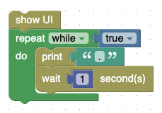

> use this little Blockly program to get familiar with "Suspend", "Resume" and "Abort" (see [Blockly workspace file](./Examples/Suspend_Resume_Abort.json))

### Text-to-Speech ###

> this example demonstrates text-to-speech synthesis using the Browser's built-in WebSpeech API (see [Blockly workspace file](./Examples/speak.json))

### WebSpeech ###

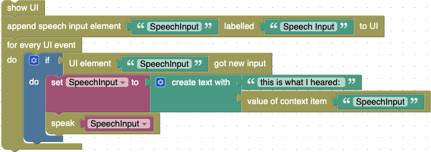

> this example illustrates how to use the Browser's built-in WebSpeech API (see [Blockly workspace file](./Examples/WebSpeech.json))

### throw ###

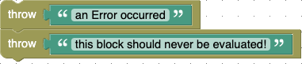

> this example illustrates how to use the "throw" block (see [Blockly workspace file](./Examples/throwError.json)) - please note, that all blocks following a "throw" will not be evaluated as throwing an exception will terminate a Blockly program

### Context ###

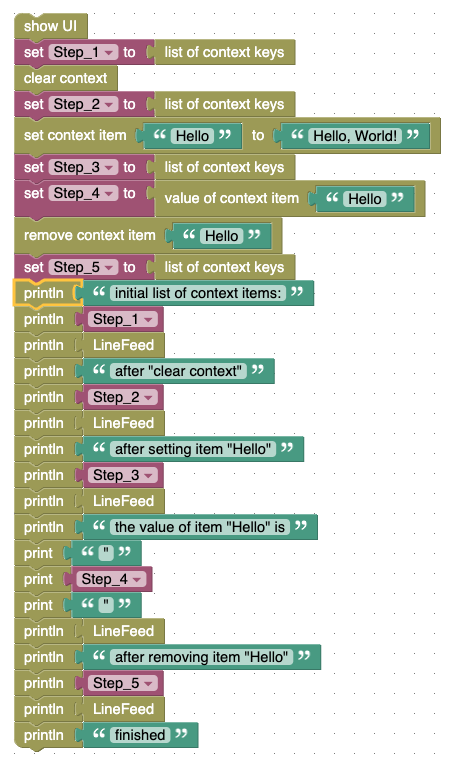

> this example demonstrates all local context functions (see [Blockly workspace file](./Examples/Context.json))

### preserve and restore ###

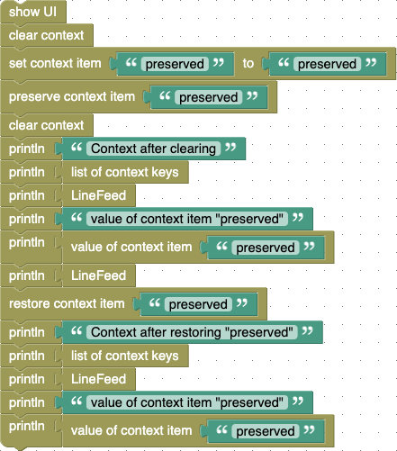

> this example demonstrates how to preserve and restore context items (see [Blockly workspace file](./Examples/preserve_restore.json))

### Textline Input ###

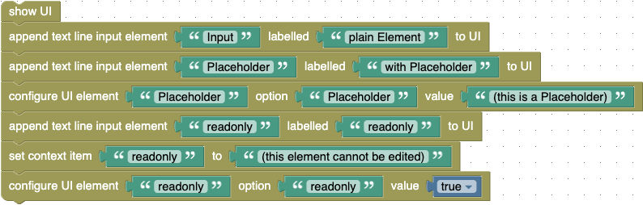

> this example shows textline input elements in several variations (see [Blockly workspace file](./Examples/TextlineInput.json))

### SpeechInput ###

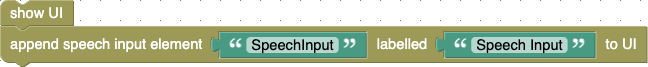

> this example demonstrates speech recognition using the Browser's built-in WebSpeech API (see [Blockly workspace file](./Examples/SpeechInput.json))

### Radiobutton Group ###

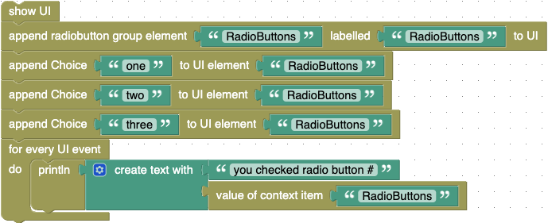

> this example illustrates how to use a radiobutton group (see [Blockly workspace file](./Examples/RadiobuttonGroup.json))

### Output Elements ###

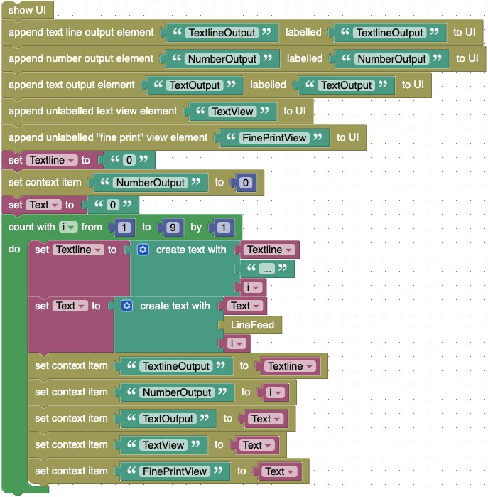

> this example shows all output elements of the playground UI (see [Blockly workspace file](./Examples/OutputElements.json))

### enable and disable ###

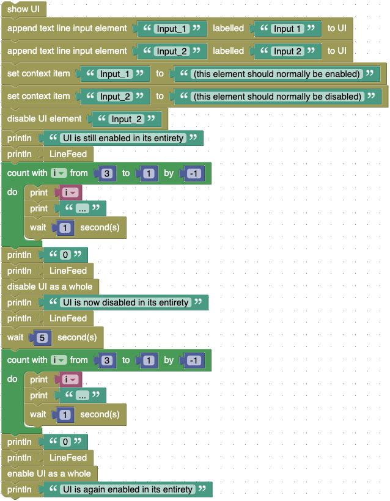

> this example demonstrates the effects of enabling or diabling either the whole UI or individual UI elements (see [Blockly workspace file](./Examples/enable_disable.json))

### Button Clicks ###

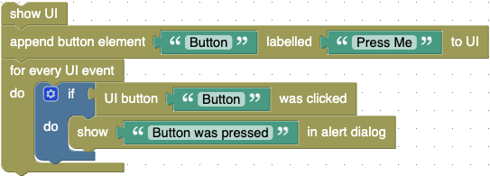

> this example demonstrates how to react on a button click (see [Blockly workspace file](./Examples/ButtonWasClicked.json))

### Objects ###

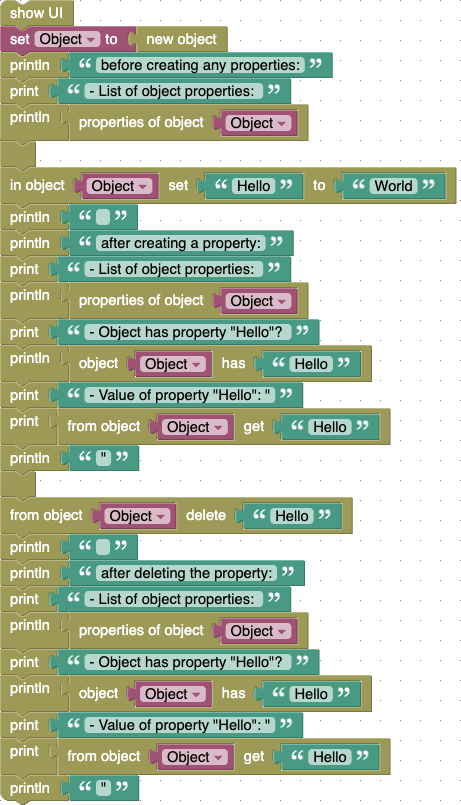

> this example demonstrates how to work with objects (see [Blockly workspace file](./Examples/Objects.json))

## AI Examples ##

The following examples actually include AI-related blocks. As before, the Blockly workspace files should first be downloaded onto your computer and then uploaded into your Blockly workspace

### Basic Settings ###

> use this example to enter your basic AI-related settings - they will be stored in the browser's storage and may then be used by other programs without having to re-enter them over and over again (see [Blockly workspace file](./Examples/basicSettings.json) - download it onto your computer and then upload it into the Blockly workspace)

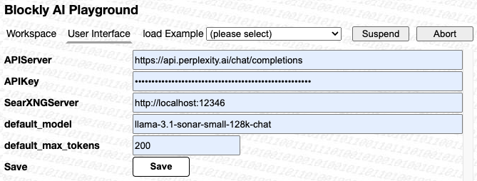

> as a hint, here are the settings used by the author himself

### Proof-of-Concept ###

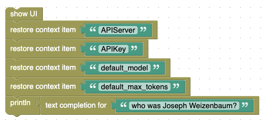

> this is the "proof-of-concept" mentioned above - play around as you like! (see [Blockly workspace file](./Examples/PoC.json) - download it onto your computer and then upload it into the Blockly workspace)

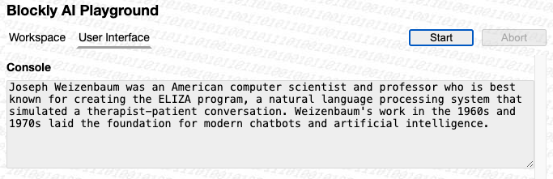

> this is what you may get as the result

### Text Summary ###

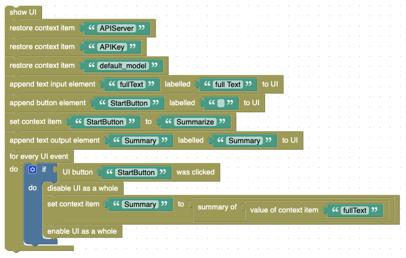

> this example summarizes a given text (see [Blockly workspace file](./Examples/TextSummary.json) - download it onto your computer and then upload it into the Blockly workspace)

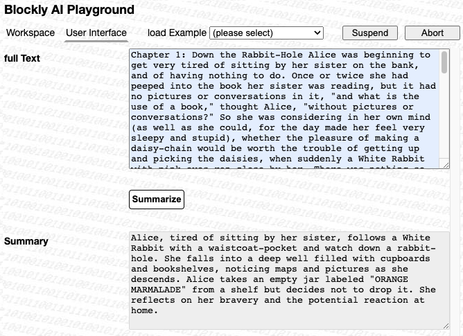

> this is the authors run to let the AI summarize the first chapter of "Alice in Wonderland" - your mileage may vary, of course

### AI Web Search ###

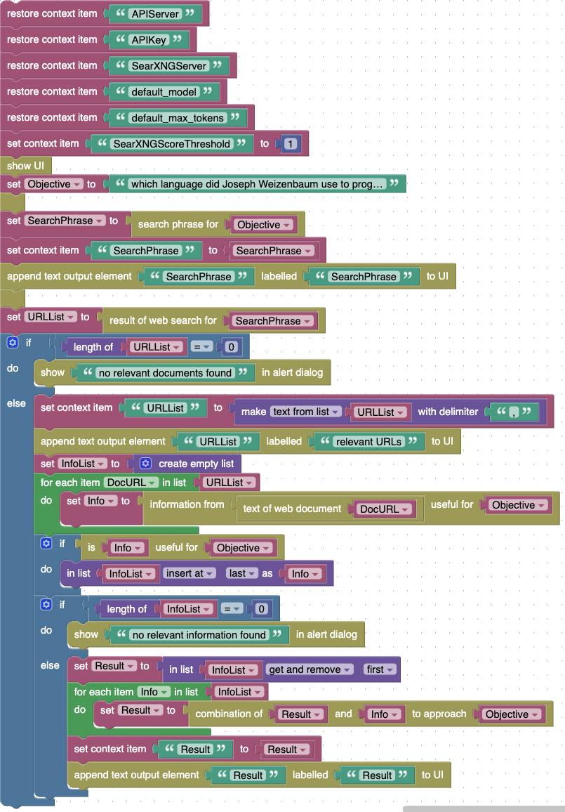

> this example illustrates how to use several AI Mezzanines to implement an AI-assisted web search (see [Blockly workspace file](./Examples/AIWebSearch.json) - download it onto your computer and then upload it into the Blockly workspace)
>
> By the way: the objective was "to which programming languages has Joseph Weizenbaum's famous "Eliza" program be ported?"

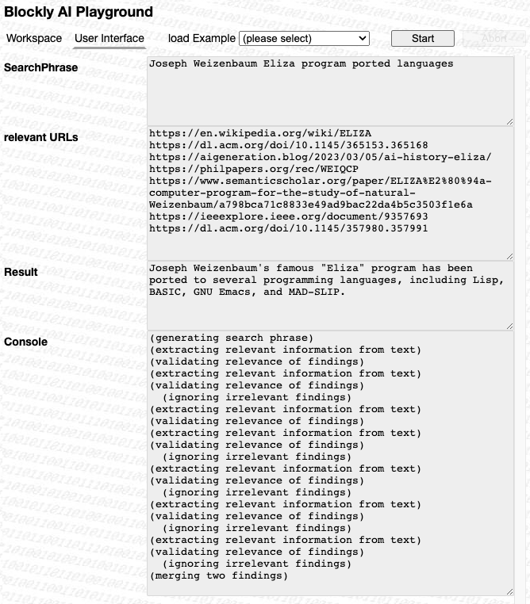

> this is the output of the author's first run: while the document found looks a bit weird (your mileage may vary) the response is impressive!
>
> (**not convinced? then just have a look at [the listed document](https://www.bussgeldbescheid-pruefer.de/index.php?id=62) (don't worry, it's in english), read it and find the relevant line yourself! presumably, you will be convinced now!**)

### AI Web Search with live Reporting ###

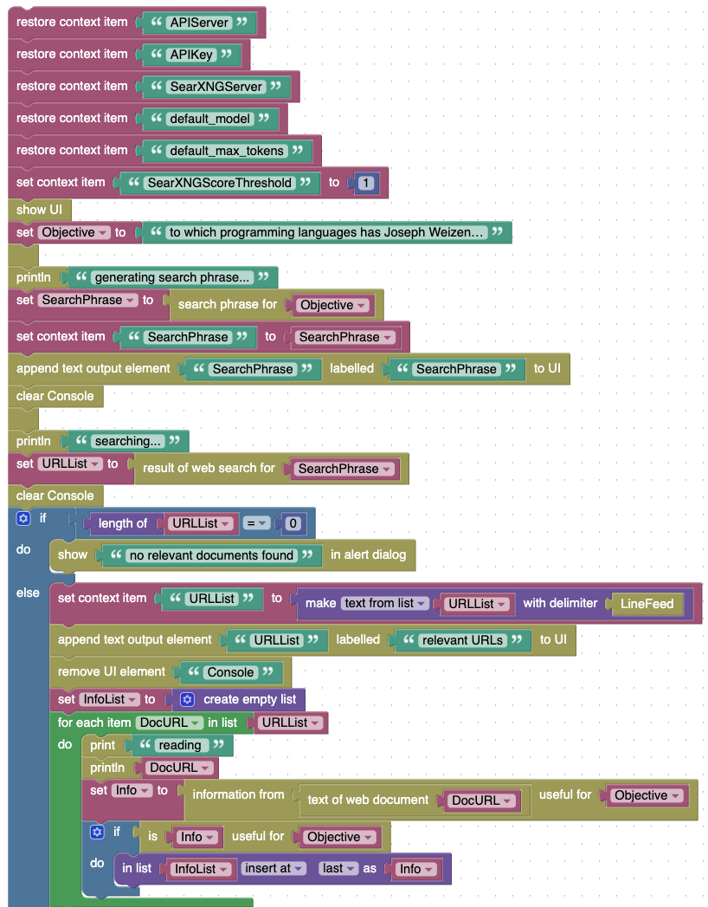
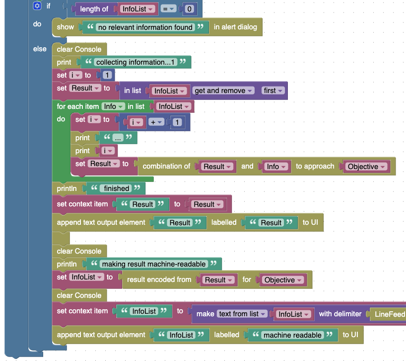

> the AI Web Search from the previous section already demonstrates that AI assisted loops may take some time to complete. However, without any recognizable feedback, users may get the impression that the program got stuck and may thus be tempted to abort it. This example therefore adds some simple live reporting of the actions the program is undertaking (see [Blockly workspace file](./Examples/AIWebSearch_reporting.json) - download it onto your computer and then upload it into the Blockly workspace)

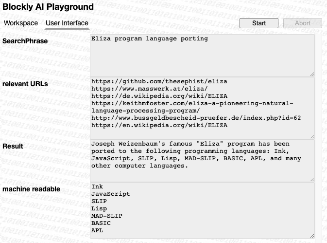

> this is what you may get after running the above example (the intermediate reports have all vanished) - see how the program "reads" all found documents and aggregates all findings into a comprehensive output - even one that can be used for further processing!

### Steps derived from a given Objective ###

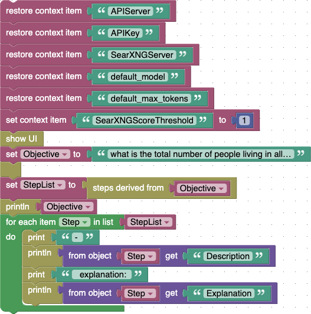

> this example demonstrates the decomposition of a given objective into smaller steps (see [Blockly workspace file](./Examples/StepsDerivedFromText.json) - download it onto your computer and then upload it into the Blockly workspace)

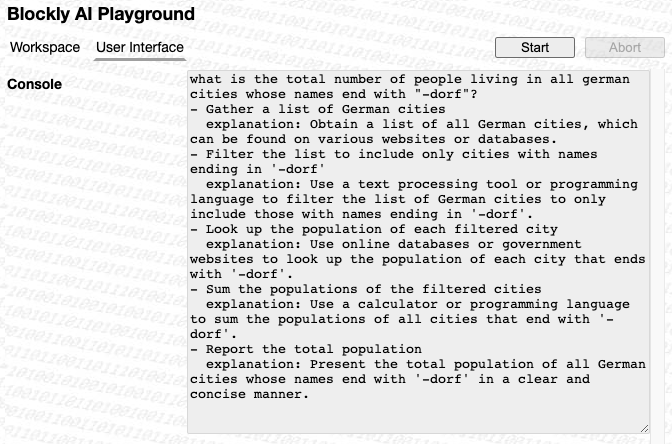

> this is what you may get when asking for the steps to solve the problem "what is the total number of people living in all german cities whose names end with "dorf"?" (an objective which is so weird that you presumably won't find the solution by a simple web search)

## License ##

[MIT License](LICENSE.md)
